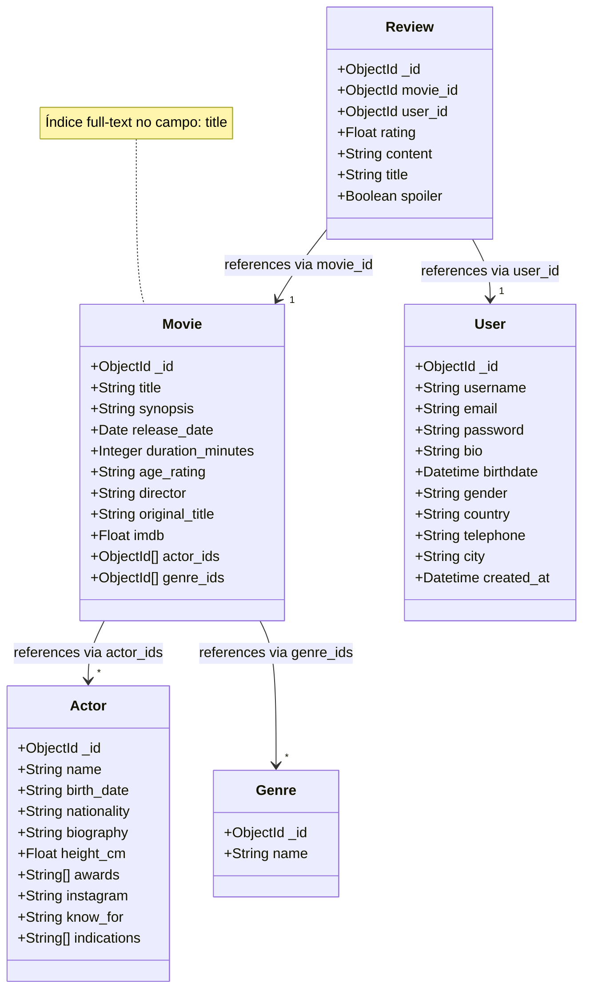

# Diagrama do Banco de Dados

```mermaid
classDiagram
    class Movie {
        +ObjectId _id
        +String title
        +String synopsis
        +Date release_date
        +Integer duration_minutes
        +String age_rating
        +String director
        +String original_title
        +Float imdb
        +ObjectId[] actor_ids
        +ObjectId[] genre_ids
    }

    class Actor {
        +ObjectId _id
        +String name
        +String birth_date
        +String nationality
        +String biography
        +Float height_cm
        +String[] awards
        +String instagram
        +String know_for
        +String[] indications
    }

    class Genre {
        +ObjectId _id
        +String name
    }

    class User {
        +ObjectId _id
        +String username
        +String email
        +String password
        +String bio
        +Datetime birthdate
        +String gender
        +String country
        +String telephone
        +String city
        +Datetime created_at
    }

    class Review {
        +ObjectId _id
        +ObjectId movie_id
        +ObjectId user_id
        +Float rating
        +String content
        +String title
        +Boolean spoiler
    }

    Movie --> "*" Actor : references via actor_ids
    Movie --> "*" Genre : references via genre_ids
    Review --> "1" Movie : references via movie_id
    Review --> "1" User : references via user_id
    
    note for Movie "Índice full-text no campo: title"
```