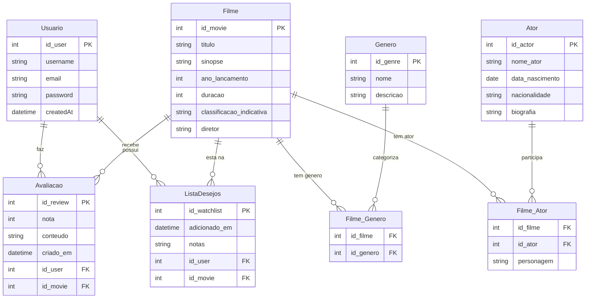

# Trabalho III - Persistência 2025.2

## Diagrama de Classes - Entidades Principais

```mermaid
erDiagram
    Usuario {
        int id_user PK
        string username
        string email
        string password
        datetime createdAt
    }

    Filme {
        int id_movie PK
        string titulo
        string sinopse
        int ano_lancamento
        int duracao
        string classificacao_indicativa
        string diretor
    }

    Genero {
        int id_genre PK
        string nome
        string descricao
    }

    Ator {
        int id_actor PK
        string nome_ator
        date data_nascimento
        string nacionalidade
        string biografia
    }

    Avaliacao {
        int id_review PK
        int nota
        string conteudo
        datetime criado_em
        int id_user FK
        int id_movie FK
    }

    ListaDesejos {
        int id_watchlist PK
        datetime adicionado_em
        string notas
        int id_user FK
        int id_movie FK
    }

    Filme_Genero {
        int id_filme FK
        int id_genero FK
    }

    Filme_Ator {
        int id_filme FK
        int id_ator FK
        string personagem
    }

    %% RELACIONAMENTOS CORRETOS para Mermaid
    Usuario ||--o{ Avaliacao : "faz"
    Filme ||--o{ Avaliacao : "recebe"
    
    Usuario ||--o{ ListaDesejos : "possui"
    Filme ||--o{ ListaDesejos : "esta na"
    
    Filme ||--o{ Filme_Genero : "tem genero"
    Genero ||--o{ Filme_Genero : "categoriza"
    
    Filme ||--o{ Filme_Ator : "tem ator"
    Ator ||--o{ Filme_Ator : "participa"
```
